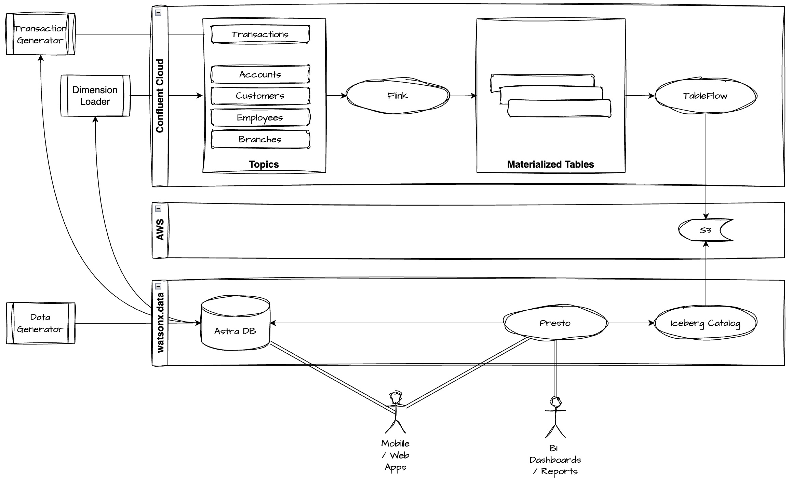

# Real-Time Banking Analytics Pipeline

Pre-processes live banking transactions so dashboards can query low-latency, pre-aggregated results without reprocessing raw transactional data on every refresh.

Features:
- synthetic banking data pipeline that generates transactions
- streams the transactions through Confluent Cloud Kafka
- processes the transactions with Confluent Cloud Flink into pre-aggregated analytics tables in Iceberg on Cloud Object Storage
- queries the data from IBM watsonx.data using Presto

## How It Works

## Components

| Component | Role |
|---|---|
| **Confluent Cloud Kafka** | Transport for both dimension snapshots and the live transaction stream |
| **Confluent Cloud Flink** | Stream processing — enriches and aggregates transactions in real time using Flink Materialized Tables |
| **IBM watsonx.data** | SQL query layer over analytics topics via Confluent Tableflow + Iceberg federation |
| **DataStax AstraDB (ODS)** | Source of truth for dimension data and optional destination for pre-aggregated analytics tables |
| **python scripts** | Script that generate synthetic data to simulate banking operational dataflow |

## Analytics Queries

| # | Flink Job | What it produces |
|---|---|---|
| Q1 | `flink/q1_txn_by_account.sql` | All transactions per account, indexed by day |
| Q2 | `flink/q2_high_value_hourly.sql` | Transactions > $10,000, partitioned by minute |
| Q3 | `flink/q3_high_value_by_city.sql` | Hourly count of transactions > $50,000 per city |
| Q4 | `flink/q4_withdrawal_by_employee.sql` | Withdrawal transactions per employee, by quarter |
| Q5a | `flink/q5a_customer_account_count.sql` | Active account count per customer |
| Q5b | `flink/q5b_customer_quarterly.sql` | Rolling quarterly spend total per customer |
| Q6 | `flink/q6_branch_daily_rollup.sql` | Daily transaction total and count per branch |

## Setup

### Confluent Cloud

See [`README_confluent_cloud.md`](README_confluent_cloud.md) for instructions on regsitering for and configuring your Confluent instance.

### Data Flow

See [`README_analytics_flink.md`](README_analytics_flink.md) for full step-by-step instructions:
environment variables, topic creation, dimension loading, Flink job deployment, and sink worker setup.
