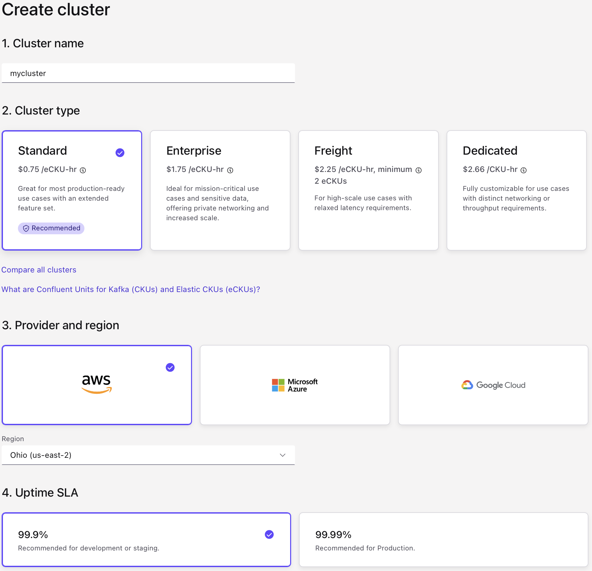
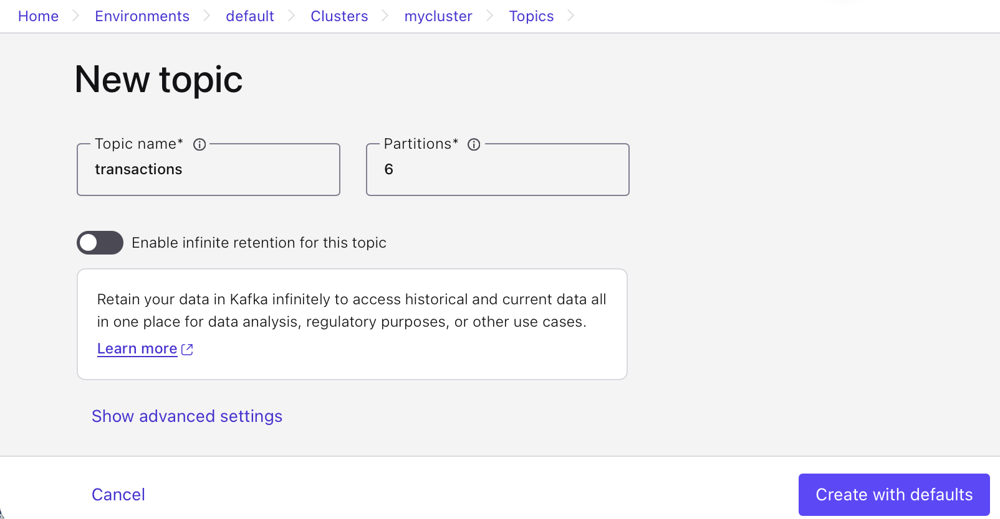
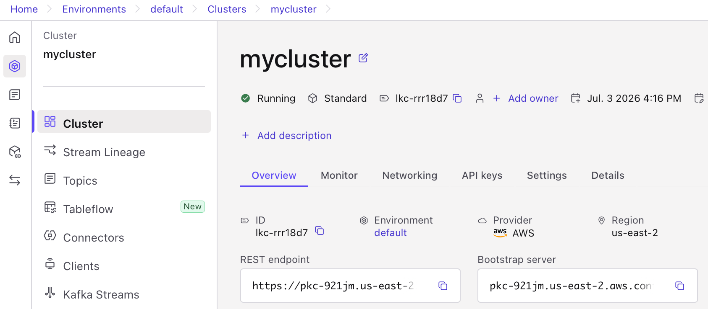
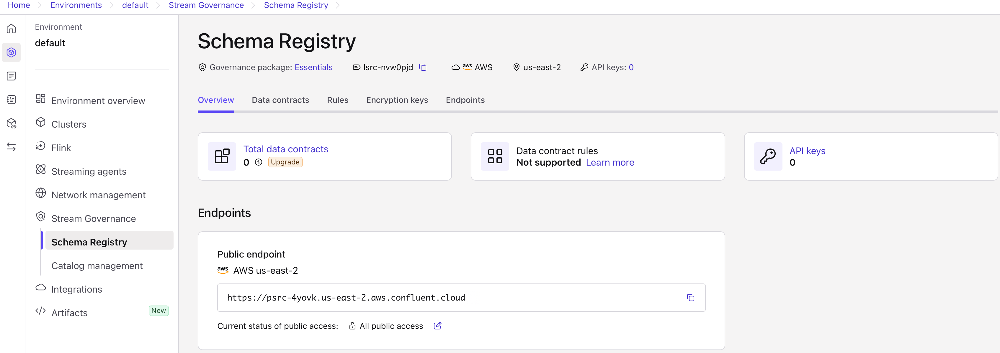
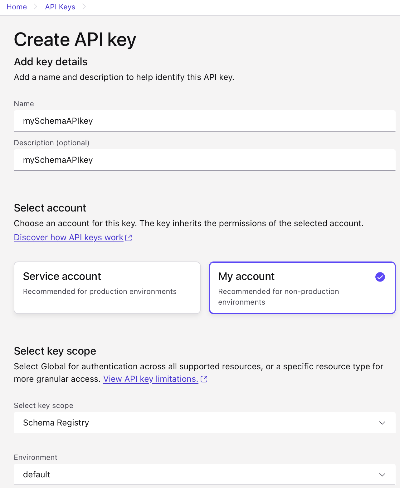

# Quick Start for Confluent Cloud

Confluent Cloud is a fully-managed, cloud-native data streaming platform powered by Apache Kafka.

Confluent Cloud has a web interface called the Cloud Console, a local command line interface, and REST APIs. Use the Cloud Console to manage cluster resources, settings, and billing. Use the Confluent CLI and REST APIs to create and manage topics and more.

This quick start gets you up and running with Confluent Cloud:

1. sign up for a free Confluent Cloud trial.
2. how to use Confluent Cloud to create topics, and produce and consume data to and from the cluster.
3. how to use Confluent Cloud for Apache Flink to run queries on the data using SQL syntax.

## Deploy a Free Cluster on Confluent Cloud

You will receive $400 free credit in your Confluent account. This credit expires after 30 days. Your free trial ends when you use all the credit or when the credit expires, whichever comes first.

### Sign Up for Confluent Cloud

- Complete the signup process - [Signup](https://www.confluent.io/get-started/).

## Create a cluster and add a topic

### Step 1: Create a Kafka cluster in Confluent Cloud

1. Sign in to [Confluent Cloud](https://confluent.cloud).
2. Click Add cluster.
3. Select an environment to use: **default**
4. Configure the cluster:
    - Cluster name: **mycluster**
    - Cluster type: **Standard**
    - Provider and region: your choice
    - Uptime SLA: **99.9%** (will consume less of your free credits)
5. Click **Launch Cluster**
6. Bypass Payment Details
    - When you reach the billing or credit card input screen, look for the option to input a promotional code.
    - Enter the promo code **CONFLUENTDEV1**
    - Select the "Skip Payment" or bypass option at the bottom of the screen.



### Step 2: Create a Kafka topic

1. From the navigation menu, click **Topics**, and then click **Create topic**.
    - Topic name: “banking.transactions”
2. Click **Create with defaults**.



## REST API for Confluent Cloud

### Step 1: Find the REST endpoint address and cluster ID

1. Sign in to [Confluent Cloud](https://confluent.cloud).
2. Navigate to the cluster you want to use, and click **Cluster settings**.
3. Note the **REST endpoint**.
4. Note the **Bootstrap server**
5. Note the **cluster ID**.



### Step 2: Create credentials

#### 1. Create API key

1. Navigate to **Cluster -> API keys**.
2. Click **Create key** and follow the prompts:
    - Select account: **My Account**
    - Description: as desired
3. Click **Download and continue**

#### 2. Create base64 encoded version

MacOS:

```sh
echo -n "<api-key>:<api-secret>" | base64
```

Linux:

```sh
echo -n "ABCDEFGH123456789:XNCIW93I2L1SQPJSJ823K1LS902KLDFMCZPWEO" | base64 -w 0
```

Windows (PowerShell only):

```powershell
[System.Convert]::ToBase64String([System.Text.Encoding]::UTF8.GetBytes("ABCDEFGH123456789:XNCIW93I2L1SQPJSJ823K1LS902KLDFMCZPWEO"))
```

### Step 3: test - List topics

```sh
curl -H "Authorization: Basic <BASE64-encoded-key-and-secret>" --request GET --url 'https://<REST-endpoint>/kafka/v3/clusters/<cluster-id>/topics'
```

## Schema Registry API for Confluent Cloud

### Step 1: Find the Schema Registry endpoint address

1. Sign in to [Confluent Cloud](https://confluent.cloud).
2. Navigate to **Schema Registry**.
3. Note the **Public endpoint**.



### Step 2: Create credentials

#### 1. Create API key

1. Click on **API keys**.
2. Click **Add API key** and follow the prompts:
    - Name: as desired
    - Description: as desired
    - Select account: **My Account**
    - Select Key Scope: **Schema Registry**
    - Enviornment: select your environment (**default**)
3. Click **Create API key**
4. Click **Download API key**


